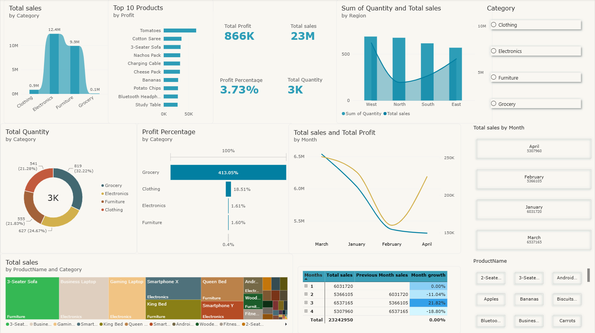
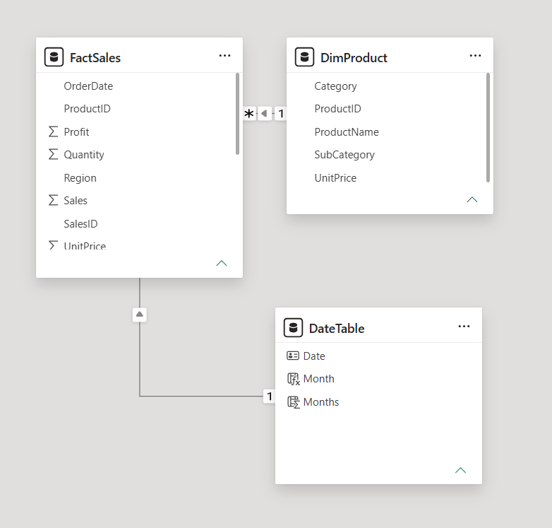

# 📊 Retail-category-sales-dashboard — Power BI

An interactive Power BI dashboard analyzing sales, profit, and quantity performance across product categories and regions, built as a hands-on practice project to apply data modelling, DAX, and dashboard design skills.

## 🖼️ Dashboard Preview



## 🔍 Overview

This dashboard provides a 360° view of sales performance, covering:
- Total sales, profit, and quantity trends across categories and regions
- Top 10 products by profit
- Category-wise profit percentage breakdown
- Month-over-month sales and profit trends
- Product-level performance via treemap visualization
- Interactive slicers for category and product-level filtering

## 🛠️ Tools & Skills Used

- **Power BI Desktop** — Report design & data visualization
- **Power Query (M)** — Data cleaning and transformation
- **DAX (Data Analysis Expressions)** — Custom measures and calculations
- **Data Modelling** — Star schema design with fact and dimension tables

## 🗂️ Data Model



Built using a **star schema** for optimal performance and clean relationships:

- **FactSales** (fact table) — Sales, Profit, Quantity, OrderDate, ProductID, Region
- **DimProduct** (dimension table) — ProductID, ProductName, Category, SubCategory, UnitPrice
- **DateTable** (date dimension) — Date, Month, Months

**Relationships:**
- `FactSales[ProductID]` → `DimProduct[ProductID]` (Many-to-One)
- `FactSales[OrderDate]` → `DateTable[Date]` (Many-to-One)

## 📐 Key DAX Measures

**Total Sales**
```DAX
Total sales = SUM(FactSales[Sales])
```

**Total Profit**
```DAX
Total Profit = SUM(FactSales[Profit])
```

**Profit Percentage**
```DAX
Profit Percentage = DIVIDE([Total Profit], [Total sales])
```

**Previous Month Sales**
```DAX
Previous Month sales = CALCULATE([Total sales], PREVIOUSMONTH(DateTable[Date]))
```

**Month Growth**
```DAX
Month growth = 
VAR CurrentSales = [Total sales]
VAR PrevSales = CALCULATE([Total sales], PREVIOUSMONTH(DateTable[Date]))
RETURN 
    DIVIDE(CurrentSales - PrevSales, PrevSales, 0)
```

**Sales Performance**
```DAX
Sales Performance = IF([Total sales] > 10000, "Achieved", "Not Achieved")
```

## 📈 Dashboard Features

- KPI cards for Total Sales, Total Profit, Profit %, and Total Quantity
- Column chart: Sales by Category
- Bar chart: Top 10 Products by Profit
- Combo chart: Quantity & Sales by Region
- Donut chart: Sales distribution by Category
- Bar chart: Profit Percentage by Category
- Line chart: Sales & Profit trend by Month
- Waterfall chart: Sales by Region (Increase/Decrease view)
- Treemap: Sales by Product Name and Category
- Interactive slicers: Category, Product Name, Month

## 📌 Notes

This is a **practice project** built on a sample dataset for learning purposes. The focus was on applying real-world dashboard design principles — data modelling, tooltip interactions, DAX measure creation, and visual storytelling — rather than production-grade data accuracy. Some values in the sample dataset reflect known inconsistencies typical of open/practice datasets.

## 🚀 What I Learned

- Structuring a star schema data model for scalable reporting
- Writing DAX measures for percentage, growth, and time-intelligence calculations
- Using Power Query for data cleaning and transformation
- Designing an intuitive, interactive dashboard layout with cross-filtering

---

📁 **File:** `Sales_Report_Power_bi.pbix`  
🔗 Connect with me on [LinkedIn](https://www.linkedin.com/in/mohan-raj-780aa2258)
